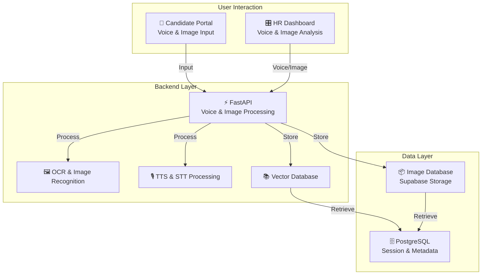
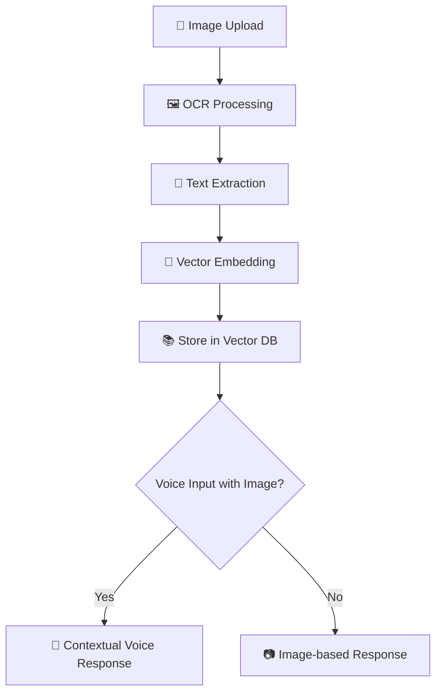
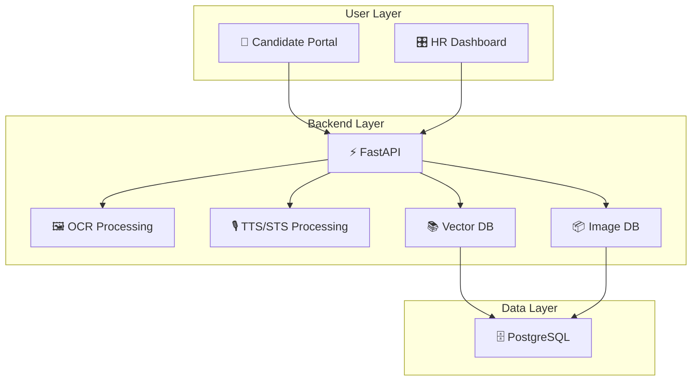
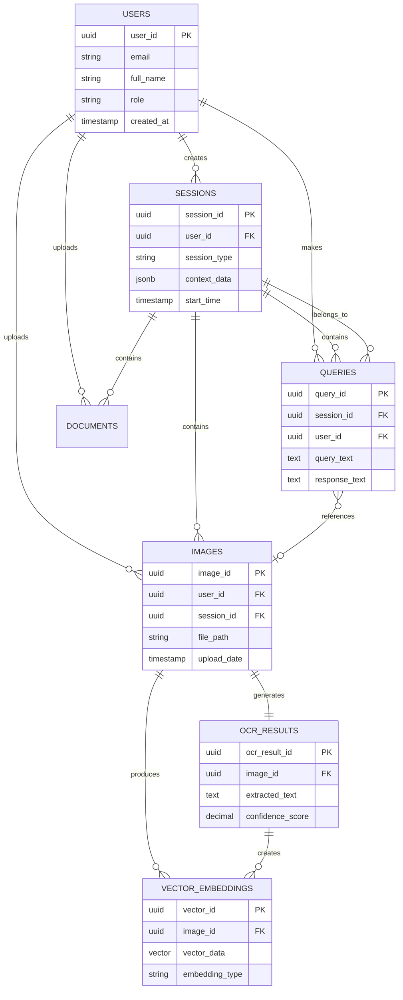

# rag_model_ocr_and_chatbot_voice_agent HLD

## Table of Contents

- Introductions
- System Overview
- Technology Stack
- Image integration Flow
- Architecture Design
- Module Description
- Data Design
- Folder Structure
- Compliance and Data Retention
- Risk and mitigations
- Success Metrics and KPIs

---

## 1. Introduction

### 1.1 Purpose

The Voice and Image-Based AI Agent project aims to provide an advanced, multimodal AI assistant for Sampurna Financial Pvt. Ltd. It leverages speech-to-text (STT), text-to-speech (TTS), and image processing to facilitate a multilingual, real-time, and interactive experience.

#### ❌ Previous Challenges

- ❌ Poor multimodal interaction
- ❌ Data loss in traditional document handling
- ❌ Delayed responses with limited context
- ❌ No real-time voice-image correlation

#### ✅ Solution Objectives

The system will:

- ✅ Integrate speech and image inputs seamlessly
- ✅ Ensure real-time interaction between voice and images
- ✅ Support multilingual content processing (English, Hindi, Bengali)
- ✅ Handle image queries and provide image-based responses

#### 📑 Problem Statement

Current communication processes rely on disjointed tools for voice and image processing. This creates inefficiencies in extracting meaningful data from multimodal inputs, leading to disjointed workflows and slower processing times.

### 1.2 🎯 Scope

#### ✅ In Scope

- Real-time voice and image integration
- Image recognition using OCR and embeddings
- Voice interaction using Sarvam TTS/Whisper STT
- Multilingual support for voice and image queries
- Real-time session handling and context memory (Redis)

#### ❌ Out of Scope

- Full automation of all image tagging
- Full replacement of human feedback in image recognition
- Multimodal integration with third-party AI systems

---

## 2. System Overview

### 2.1 System Architecture

The Voice and Image-Based AI Agent is a multimodal platform designed to integrate voice and image inputs. The architecture consists of various modules, including the frontend interfaces for voice and image interaction, backend services for processing these inputs, and the storage system for managing the data.

#### Key Components:

- **Frontend**: Web and mobile interfaces for image upload and voice input.
- **Backend**: Real-time AI processing using voice recognition and image analysis.
- **Data Storage**: PostgreSQL with Supabase for storing user sessions, images, and metadata.
- **Middleware**: Image processing (OCR, embeddings) and language detection modules.

[Diagram 1: System Architecture Overview]



### 2.2 Architecture Layers

#### Presentation Layer (Frontend)
- **Candidate Portal**: Self-service interface for job candidates
  - Voice query input with real-time transcription
  - Image upload with drag-and-drop support
  - Session history and query tracking
  - Multi-language interface (English, Hindi, Bengali)
  
- **HR Dashboard**: Administrative interface for HR personnel
  - Candidate interaction analytics
  - Image and document review
  - Voice query monitoring
  - Performance metrics and reports

#### Application Layer (Backend)
- **API Gateway**: FastAPI-based REST and WebSocket endpoints
  - Request validation and authentication
  - Rate limiting and throttling
  - Request/response logging
  - Error handling and recovery

- **Business Logic**: Core application services
  - Query processing and routing
  - Session management
  - Context aggregation
  - Response generation

#### Processing Layer (Middleware)
- **OCR Service**: Image text extraction
  - Multiple OCR engine support
  - Preprocessing and enhancement
  - Language detection
  - Confidence scoring

- **Voice Service**: Speech processing
  - STT with real-time streaming
  - TTS with voice customization
  - Audio quality enhancement
  - Language identification

- **Embedding Service**: Vector generation
  - Text embedding (sentence-transformers)
  - Image embedding (CLIP)
  - Multi-modal embedding alignment
  - Dimensionality optimization

#### Data Layer
- **Relational Database**: PostgreSQL with Supabase
  - User and session data
  - Query logs and metadata
  - Audit trails
  - Referential integrity

- **Object Storage**: Supabase Storage
  - Image files with versioning
  - Audio recordings
  - Document uploads
  - CDN integration

- **Vector Database**: pgvector extension
  - High-dimensional embeddings
  - Similarity search
  - Nearest neighbor queries
  - Clustering support

- **Cache Layer**: Redis
  - Session state
  - Frequently accessed data
  - Real-time context
  - Pub/Sub messaging

### 2.3 System Characteristics

#### Scalability
- **Horizontal Scaling**: Stateless API servers can be scaled independently
- **Load Balancing**: Nginx for distributing traffic across instances
- **Database Scaling**: Read replicas for query performance
- **Caching Strategy**: Multi-tier caching (Redis, CDN, browser)

#### Reliability
- **High Availability**: Multi-AZ deployment with failover
- **Error Recovery**: Automatic retry with exponential backoff
- **Circuit Breakers**: Prevent cascade failures
- **Health Checks**: Continuous monitoring of all services

#### Performance
- **Response Time**: <500ms for 95th percentile
- **Throughput**: 1000+ requests per second
- **Concurrent Users**: Support for 10,000+ simultaneous sessions
- **Image Processing**: <2 seconds per image

#### Security
- **Authentication**: JWT-based with refresh tokens
- **Authorization**: Role-based access control (RBAC)
- **Encryption**: TLS 1.3 for data in transit, AES-256 for data at rest
- **Data Privacy**: PII anonymization and GDPR compliance

---

## 3. Technology Stack

| Layer | Primary Technology | Purpose |
|-------|-------------------|---------|
| Frontend | Streamlit, HTML5, JavaScript | Web and mobile interfaces for voice/image input |
| Backend | FastAPI, Python, WebSockets | Real-time interaction processing |
| Image Handling | PaddleOCR, Tesseract, OpenCV | Image OCR and recognition |
| Voice | Sarvam TTS, Whisper STT, Gemini | Voice input/output processing |
| Database | PostgreSQL, Supabase | Data management and storage |
| Containerization | Docker | Deployment and scaling |

### 3.1 Detailed Technology Breakdown

#### Frontend Technologies
- **Streamlit**: Rapid prototyping and interactive data applications
- **HTML5/CSS3**: Modern web standards for responsive design
- **JavaScript (ES6+)**: Client-side logic and interactivity
- **TailwindCSS**: Utility-first CSS framework for custom styling
- **WebRTC**: Real-time audio/video communication for voice features

#### Backend Technologies
- **FastAPI**: High-performance async web framework
  - Automatic API documentation (Swagger/OpenAPI)
  - Built-in data validation with Pydantic
  - Native async/await support for concurrent operations
- **Python 3.10+**: Core programming language
- **WebSockets**: Bi-directional real-time communication
- **Uvicorn**: ASGI server for production deployment

#### Image Processing Stack
- **PaddleOCR**: Deep learning-based OCR engine
  - Supports 80+ languages including English, Hindi, Bengali
  - High accuracy for printed and handwritten text
- **Tesseract OCR**: Fallback OCR engine for specialized cases
- **OpenCV**: Image preprocessing and manipulation
  - Noise reduction
  - Image enhancement
  - Format conversion
- **Pillow (PIL)**: Python imaging library for basic operations

#### Voice Processing Technologies
- **Sarvam AI TTS**: Text-to-speech for Indian languages
  - Natural-sounding voice synthesis
  - Support for Hindi, Bengali, English accents
- **OpenAI Whisper**: Speech-to-text engine
  - High accuracy multilingual transcription
  - Robust to background noise
  - Support for 99+ languages
- **Google Gemini**: Advanced language understanding
  - Context-aware responses
  - Multimodal processing capabilities

#### Database & Storage
- **PostgreSQL 15+**: Primary relational database
  - ACID compliance for data integrity
  - Advanced indexing for fast queries
  - Full-text search capabilities
- **Supabase**: Backend-as-a-Service platform
  - Real-time subscriptions
  - Row-level security
  - Auto-generated REST APIs
  - Built-in authentication
- **Supabase Storage**: Object storage for media files
  - Image and document storage
  - CDN integration
  - Automatic image optimization
- **pgvector Extension**: Vector similarity search
  - Efficient nearest-neighbor search
  - Cosine similarity calculations
  - Support for embeddings up to 2000 dimensions

#### Caching & Session Management
- **Redis**: In-memory data store
  - Session state management
  - Real-time context caching
  - Pub/Sub for real-time notifications
  - TTL-based automatic cleanup

#### AI/ML Libraries
- **sentence-transformers**: Text embedding generation
  - Multi-language sentence embeddings
  - Semantic similarity calculations
- **CLIP (OpenAI)**: Image-text embedding alignment
  - Joint vision-language representations
  - Zero-shot image classification
- **LangChain**: LLM orchestration framework
  - Chain-of-thought reasoning
  - Document retrieval and QA
  - Memory management

#### DevOps & Deployment
- **Docker**: Containerization platform
  - Consistent development environments
  - Easy deployment and scaling
- **Docker Compose**: Multi-container orchestration
  - Development environment setup
  - Service dependency management
- **Nginx**: Reverse proxy and load balancer
  - SSL/TLS termination
  - Static file serving
  - Request routing

#### Monitoring & Logging
- **Prometheus**: Metrics collection and monitoring
- **Grafana**: Visualization and alerting
- **ELK Stack** (Optional): Centralized logging
  - Elasticsearch: Log storage and search
  - Logstash: Log aggregation
  - Kibana: Log visualization

### 3.2 Key Enhancements

- **Multimodal Inputs**: Supports voice and image for real-time analysis and response.
- **Image Processing**: OCR capabilities for text recognition in images, stored as vector embeddings.
- **Session Memory**: Uses Redis to maintain context during interactions.
- **Scalability**: Containerized architecture for horizontal scaling.
- **Real-time Processing**: WebSocket support for live interactions.
- **Multilingual Support**: Native support for English, Hindi, and Bengali.

---

## 4. Image Integration Flow

### 4.1 Image Input Flow

- User Uploads Image:
- The user uploads an image (e.g., screenshot, document) via the interface.
- The image is processed in real-time for text extraction using OCR (PaddleOCR/Tesseract).
- OCR Processing:
- The text extracted from the image is parsed and stored.
- If the image contains structured data (e.g., a form), the relevant fields are extracted.
- Vectorization:
- The text extracted from the image is converted into vector embeddings and stored in the Supabase vector database for future searches and queries.
- Voice + Image Context:
- When a voice query is paired with an image, the system analyzes both inputs and provides contextually appropriate responses (e.g., voice question with a related image for clarification).

[Diagram 2: Image Processing Flow]



### 4.2 Data Flow for Image Processing

| Step | Description |
|------|-------------|
| Image Upload | User uploads an image via the interface (web or mobile). |
| OCR Extraction | Extract text using OCR tools (PaddleOCR/Tesseract). |
| Vectorization | Convert extracted text to vector embeddings for storage and future queries. |
| Image Storage | Store images and OCR results in Supabase Storage. |
| Vector DB | Store vector embeddings in Supabase Vector Database for text matching and retrieval. |

---

## 5. Architecture Design

### 5.1 Overall Architecture

[Diagram 3: High-Level Architecture]



---

## 6. Module Descriptions

### 6.1 Image Processing Module

#### Overview
The Image Processing Module is responsible for extracting, analyzing, and vectorizing text and visual information from uploaded images. It serves as a critical component for enabling multimodal interactions.

#### Core Components

**OCR Integration**
- **Primary Engine**: PaddleOCR for deep learning-based text recognition
- **Fallback Engine**: Tesseract for specialized or low-quality images
- **Supported Formats**: JPG, PNG, WEBP, TIFF, BMP
- **Processing Pipeline**:
  1. Image upload and validation
  2. Preprocessing (noise reduction, contrast enhancement)
  3. Text detection and localization
  4. Text recognition with confidence scores
  5. Post-processing (spell check, language detection)

**Image Recognition**
- **Field Extraction**: Automatically identifies and extracts key fields
  - Dates and timestamps
  - Names and personal information
  - Document numbers and IDs
  - Company-specific form fields
- **Form Understanding**: Template matching for structured documents
- **Confidence Scoring**: Each extracted field includes a confidence metric
- **Validation Rules**: Business logic for data validation

#### Technical Implementation

```python
# Example OCR Processing Flow
class ImageProcessor:
    def process_image(self, image_path):
        # Preprocess image
        processed_img = self.preprocess(image_path)
        
        # Extract text using PaddleOCR
        ocr_results = self.paddle_ocr.ocr(processed_img)
        
        # Generate embeddings
        text_embedding = self.generate_embedding(ocr_results)
        
        # Store in vector database
        self.store_vector(text_embedding)
        
        return ocr_results
```

#### Performance Metrics
- **OCR Accuracy**: Target ≥95% for printed text
- **Processing Speed**: <2 seconds per image (avg 1MB size)
- **Supported Languages**: English, Hindi, Bengali, 80+ others
- **Concurrent Processing**: Up to 10 simultaneous image uploads

---

### 6.2 Voice Integration Module

#### Overview
The Voice Integration Module handles all speech-related functionalities, enabling users to interact with the system through natural language voice commands.

#### Speech-to-Text (STT)

**Primary Engine: OpenAI Whisper**
- **Model**: whisper-large-v3 for maximum accuracy
- **Features**:
  - Real-time transcription with <500ms latency
  - Automatic language detection
  - Punctuation and capitalization
  - Speaker diarization (optional)
  - Noise suppression and echo cancellation

**Processing Pipeline**:
1. Audio capture from microphone/upload
2. Audio preprocessing (noise reduction, normalization)
3. Chunking for real-time processing
4. Transcription with language detection
5. Post-processing and formatting
6. Context integration with session data

**Supported Audio Formats**:
- WAV, MP3, M4A, FLAC, OGG
- Sample rates: 8kHz to 48kHz
- Mono and stereo support

#### Text-to-Speech (TTS)

**Primary Engine: Sarvam AI**
- **Voice Selection**: Natural-sounding Indian accents
- **Languages**: Hindi, Bengali, Indian English
- **Features**:
  - Emotion and tone control
  - Speed and pitch adjustment
  - SSML support for advanced control
  - Streaming synthesis for real-time output

**Fallback Engine: Google Cloud TTS**
- Used for languages not supported by Sarvam
- WaveNet models for high-quality synthesis

#### Voice Context Management
- **Session Linking**: Voice queries linked to active session
- **Context Retention**: Previous conversation context maintained
- **Image Correlation**: Voice queries can reference uploaded images
- **Multi-turn Conversations**: Support for follow-up questions

#### Technical Implementation

```python
# Example STT/TTS Flow
class VoiceProcessor:
    def process_voice_input(self, audio_data, session_id):
        # Transcribe audio
        transcription = self.whisper_stt.transcribe(audio_data)
        
        # Get context from session
        context = self.session_manager.get_context(session_id)
        
        # Process query with context
        response = self.process_query(transcription, context)
        
        # Generate speech response
        audio_response = self.sarvam_tts.synthesize(response)
        
        return audio_response
```

---

### 6.3 Data Storage Module

#### Overview
The Data Storage Module manages all persistent data, including images, documents, vector embeddings, and structured metadata.

#### Supabase Database

**Schema Design**:
- **Tables**: Users, Sessions, Images, OCR_Results, Queries, Vector_Embeddings
- **Indexes**: Optimized for common query patterns
- **Constraints**: Foreign keys, unique constraints, check constraints
- **Triggers**: Automatic timestamp updates, audit logging

**Key Features**:
- Row-level security (RLS) for multi-tenant isolation
- Real-time subscriptions for live updates
- Built-in authentication and authorization
- Auto-generated REST and GraphQL APIs

**Query Optimization**:
- Prepared statements for common queries
- Connection pooling for efficient resource usage
- Query result caching with Redis
- Materialized views for complex aggregations

#### Supabase Storage

**Image Storage**:
- **Buckets**: Organized by user, date, and type
- **Policies**: Access control based on user permissions
- **Features**:
  - Automatic image resizing and optimization
  - CDN distribution for fast access
  - Signed URLs for secure access
  - Duplicate detection via content hashing

**Document Storage**:
- **Supported Types**: PDF, DOCX, XLSX, TXT
- **Metadata Tracking**: Upload date, size, mime type, user
- **Versioning**: Multiple versions of same document
- **Retention Policies**: Automatic cleanup based on age

#### Vector Database

**pgvector Extension**:
- **Embedding Dimensions**: 384 (sentence-transformers) or 512 (CLIP)
- **Distance Metrics**: Cosine similarity, L2 distance, inner product
- **Indexing**: IVFFlat or HNSW for fast approximate search
- **Performance**: Sub-100ms search for 1M+ vectors

**Vector Operations**:
- Similarity search for text and images
- Multi-modal search (text query for images)
- Clustering and classification
- Anomaly detection

#### Backup and Recovery

- **Automated Backups**: Daily full backups, hourly incremental
- **Retention**: 30-day backup retention
- **Point-in-Time Recovery**: Restore to any point within retention period
- **Disaster Recovery**: Multi-region replication for high availability

---

### 6.4 Session Memory and Context Module

#### Overview
The Session Management Module maintains conversation context and user state across interactions, enabling coherent multi-turn conversations.

#### Redis Implementation

**Session Data Structure**:
```json
{
  "session_id": "uuid",
  "user_id": "user_uuid",
  "created_at": "timestamp",
  "last_active": "timestamp",
  "context": {
    "conversation_history": [],
    "uploaded_images": [],
    "extracted_entities": {},
    "user_preferences": {}
  },
  "ttl": 3600
}
```

**Key Features**:
- **TTL Management**: Automatic session expiration after inactivity
- **Context Compression**: Summarization of long conversations
- **Priority Queuing**: Recent context prioritized over older
- **Multi-Device Sync**: Session shared across devices

#### Context Management

**Conversation History**:
- Last N turns stored (configurable, default 10)
- Summarization for turns beyond threshold
- Entity extraction and tracking
- Sentiment analysis

**Image Context**:
- References to uploaded images within session
- OCR results linked to conversation
- Visual context for voice queries
- Image-text correlation tracking

**User Preferences**:
- Language preference
- Voice settings (speed, pitch)
- UI preferences
- Privacy settings

#### Real-time Updates

**Pub/Sub Mechanism**:
- Redis Pub/Sub for real-time notifications
- WebSocket integration for instant updates
- Event-driven architecture
- Multi-user collaboration support

#### Performance Optimization

- **Connection Pooling**: Reuse Redis connections
- **Pipeline Operations**: Batch multiple Redis commands
- **Lazy Loading**: Load context only when needed
- **Cache Warming**: Pre-load frequently accessed sessions

---

## 7. Data Design

### 7.1 Core Entities

| Entity | Purpose | Sample Columns |
|--------|---------|----------------|
| Images | Stores image metadata | image_id, user_id, upload_date, ocr_result_id |
| OCR Results | Stores OCR-extracted text | ocr_result_id, image_id, extracted_text |
| Sessions | Tracks user interactions | session_id, user_id, context_data, start_time |
| Vector Data | Stores vector embeddings | vector_id, image_id, vector_data |
| Queries | Tracks user queries | query_id, session_id, query_text, response_text |

### 7.2 Detailed Database Schema

#### Users Table
```sql
CREATE TABLE users (
    user_id UUID PRIMARY KEY DEFAULT gen_random_uuid(),
    email VARCHAR(255) UNIQUE NOT NULL,
    full_name VARCHAR(255),
    phone_number VARCHAR(20),
    role VARCHAR(50) CHECK (role IN ('candidate', 'hr', 'admin')),
    language_preference VARCHAR(10) DEFAULT 'en',
    created_at TIMESTAMP DEFAULT NOW(),
    updated_at TIMESTAMP DEFAULT NOW(),
    last_login TIMESTAMP,
    is_active BOOLEAN DEFAULT true,
    metadata JSONB
);

CREATE INDEX idx_users_email ON users(email);
CREATE INDEX idx_users_role ON users(role);
```

#### Sessions Table
```sql
CREATE TABLE sessions (
    session_id UUID PRIMARY KEY DEFAULT gen_random_uuid(),
    user_id UUID REFERENCES users(user_id) ON DELETE CASCADE,
    session_type VARCHAR(50) CHECK (session_type IN ('voice', 'image', 'mixed')),
    context_data JSONB,
    start_time TIMESTAMP DEFAULT NOW(),
    end_time TIMESTAMP,
    last_activity TIMESTAMP DEFAULT NOW(),
    device_info JSONB,
    ip_address INET,
    is_active BOOLEAN DEFAULT true
);

CREATE INDEX idx_sessions_user ON sessions(user_id);
CREATE INDEX idx_sessions_active ON sessions(is_active) WHERE is_active = true;
CREATE INDEX idx_sessions_start_time ON sessions(start_time DESC);
```

#### Images Table
```sql
CREATE TABLE images (
    image_id UUID PRIMARY KEY DEFAULT gen_random_uuid(),
    user_id UUID REFERENCES users(user_id) ON DELETE CASCADE,
    session_id UUID REFERENCES sessions(session_id) ON DELETE SET NULL,
    file_path TEXT NOT NULL,
    file_name VARCHAR(255),
    file_size BIGINT,
    mime_type VARCHAR(100),
    image_hash VARCHAR(64) UNIQUE, -- For duplicate detection
    upload_date TIMESTAMP DEFAULT NOW(),
    width INTEGER,
    height INTEGER,
    metadata JSONB,
    processing_status VARCHAR(50) DEFAULT 'pending'
        CHECK (processing_status IN ('pending', 'processing', 'completed', 'failed')),
    ocr_completed BOOLEAN DEFAULT false,
    embedding_generated BOOLEAN DEFAULT false
);

CREATE INDEX idx_images_user ON images(user_id);
CREATE INDEX idx_images_session ON images(session_id);
CREATE INDEX idx_images_upload_date ON images(upload_date DESC);
CREATE INDEX idx_images_hash ON images(image_hash);
CREATE INDEX idx_images_status ON images(processing_status);
```

#### OCR_Results Table
```sql
CREATE TABLE ocr_results (
    ocr_result_id UUID PRIMARY KEY DEFAULT gen_random_uuid(),
    image_id UUID REFERENCES images(image_id) ON DELETE CASCADE,
    extracted_text TEXT,
    language_detected VARCHAR(10),
    confidence_score DECIMAL(5,2), -- Overall confidence 0-100
    ocr_engine VARCHAR(50), -- 'paddleocr' or 'tesseract'
    processing_time_ms INTEGER,
    created_at TIMESTAMP DEFAULT NOW(),
    structured_data JSONB, -- Extracted fields (name, date, etc.)
    bounding_boxes JSONB, -- Text location information
    word_count INTEGER,
    character_count INTEGER
);

CREATE INDEX idx_ocr_image ON ocr_results(image_id);
CREATE INDEX idx_ocr_language ON ocr_results(language_detected);
CREATE INDEX idx_ocr_created ON ocr_results(created_at DESC);
CREATE INDEX idx_ocr_text_search ON ocr_results USING gin(to_tsvector('english', extracted_text));
```

#### Vector_Embeddings Table
```sql
CREATE TABLE vector_embeddings (
    vector_id UUID PRIMARY KEY DEFAULT gen_random_uuid(),
    image_id UUID REFERENCES images(image_id) ON DELETE CASCADE,
    ocr_result_id UUID REFERENCES ocr_results(ocr_result_id) ON DELETE CASCADE,
    embedding_type VARCHAR(50) CHECK (embedding_type IN ('text', 'image', 'multimodal')),
    model_name VARCHAR(100), -- e.g., 'sentence-transformers', 'clip'
    vector_data vector(384), -- Using pgvector extension
    created_at TIMESTAMP DEFAULT NOW(),
    metadata JSONB
);

CREATE INDEX idx_vector_image ON vector_embeddings(image_id);
CREATE INDEX idx_vector_type ON vector_embeddings(embedding_type);
-- Vector similarity index (IVFFlat for approximate nearest neighbor)
CREATE INDEX idx_vector_similarity ON vector_embeddings 
    USING ivfflat (vector_data vector_cosine_ops) WITH (lists = 100);
```

#### Queries Table
```sql
CREATE TABLE queries (
    query_id UUID PRIMARY KEY DEFAULT gen_random_uuid(),
    session_id UUID REFERENCES sessions(session_id) ON DELETE CASCADE,
    user_id UUID REFERENCES users(user_id) ON DELETE CASCADE,
    query_type VARCHAR(50) CHECK (query_type IN ('text', 'voice', 'image')),
    query_text TEXT,
    query_language VARCHAR(10),
    audio_file_path TEXT, -- If voice query
    image_id UUID REFERENCES images(image_id), -- If image-based query
    response_text TEXT,
    response_audio_path TEXT,
    processing_time_ms INTEGER,
    created_at TIMESTAMP DEFAULT NOW(),
    metadata JSONB,
    feedback_rating INTEGER CHECK (feedback_rating BETWEEN 1 AND 5),
    feedback_comment TEXT
);

CREATE INDEX idx_queries_session ON queries(session_id);
CREATE INDEX idx_queries_user ON queries(user_id);
CREATE INDEX idx_queries_type ON queries(query_type);
CREATE INDEX idx_queries_created ON queries(created_at DESC);
CREATE INDEX idx_queries_text_search ON queries USING gin(to_tsvector('english', query_text));
```

#### Documents Table
```sql
CREATE TABLE documents (
    document_id UUID PRIMARY KEY DEFAULT gen_random_uuid(),
    user_id UUID REFERENCES users(user_id) ON DELETE CASCADE,
    session_id UUID REFERENCES sessions(session_id) ON DELETE SET NULL,
    document_type VARCHAR(50) CHECK (document_type IN ('pdf', 'docx', 'xlsx', 'kyc', 'other')),
    file_path TEXT NOT NULL,
    file_name VARCHAR(255),
    file_size BIGINT,
    mime_type VARCHAR(100),
    document_hash VARCHAR(64) UNIQUE,
    upload_date TIMESTAMP DEFAULT NOW(),
    page_count INTEGER,
    extracted_text TEXT,
    metadata JSONB,
    processing_status VARCHAR(50) DEFAULT 'pending'
);

CREATE INDEX idx_documents_user ON documents(user_id);
CREATE INDEX idx_documents_type ON documents(document_type);
CREATE INDEX idx_documents_upload_date ON documents(upload_date DESC);
```

#### Audit_Logs Table
```sql
CREATE TABLE audit_logs (
    log_id UUID PRIMARY KEY DEFAULT gen_random_uuid(),
    user_id UUID REFERENCES users(user_id) ON DELETE SET NULL,
    action VARCHAR(100) NOT NULL,
    resource_type VARCHAR(50),
    resource_id UUID,
    timestamp TIMESTAMP DEFAULT NOW(),
    ip_address INET,
    user_agent TEXT,
    status VARCHAR(20) CHECK (status IN ('success', 'failure')),
    details JSONB
);

CREATE INDEX idx_audit_user ON audit_logs(user_id);
CREATE INDEX idx_audit_timestamp ON audit_logs(timestamp DESC);
CREATE INDEX idx_audit_action ON audit_logs(action);
```

### 7.3 Entity Relationships



### 7.4 Data Flow Patterns

#### Image Upload and Processing Flow
1. User uploads image → `images` table (status: 'pending')
2. OCR processing → `ocr_results` table
3. Embedding generation → `vector_embeddings` table
4. Update image status → 'completed'
5. Link to session → `sessions.context_data` updated

#### Voice Query Flow
1. Audio captured → Stored temporarily
2. STT processing → Text extracted
3. Query saved → `queries` table
4. Context retrieved → From `sessions` and `vector_embeddings`
5. Response generated → Saved to `queries.response_text`
6. TTS processing → Audio response generated

#### Search and Retrieval Flow
1. User query → Converted to embedding
2. Vector similarity search → `vector_embeddings` table
3. Retrieve associated images → Join with `images` table
4. Fetch OCR results → Join with `ocr_results` table
5. Rank and return results → Based on similarity scores

### 7.5 Data Retention and Archival

| Data Type | Hot Storage | Warm Storage | Cold Storage | Deletion |
|-----------|-------------|--------------|--------------|----------|
| Active Sessions | Redis (1 hour) | - | - | Auto-expire |
| Recent Images | Supabase (30 days) | S3 (1 year) | Glacier (5 years) | After 5 years |
| OCR Results | PostgreSQL (90 days) | Archive DB (5 years) | - | After 5 years |
| Query Logs | PostgreSQL (1 year) | Archive DB (5 years) | - | After 5 years |
| Audit Logs | PostgreSQL (2 years) | Archive DB (7 years) | - | After 7 years |

---

## 8. Folder Structure

```
voice-image-ai-agent/
│
├── api/
│   ├── __init__.py                    # FastAPI application entry point
│   ├── main.py                        # API routing and request handling
│   ├── image_processing.py            # Image handling (OCR, embeddings)
│   ├── speech_processing.py           # STT & TTS integration
│   ├── session_management.py          # Session handling and context memory (Redis)
│   └── vector_search.py               # Vector DB integration and search
│
├── frontend/
│   ├── index.html                     # Web frontend HTML (candidate and HR portals)
│   ├── app.js                         # Frontend logic and image/voice interaction
│   ├── style.css                      # Custom styles (TailwindCSS integration)
│   └── voice-image-component.js       # Component for handling voice and image uploads
│
├── storage/
│   ├── image_storage.py               # Image upload and storage management (Supabase)
│   ├── document_storage.py            # Document (PDF, KYC) storage handling
│   └── vector_storage.py              # Vector DB management (Supabase or other)
│
├── middleware/
│   ├── ocr_processing.py              # OCR processing (PaddleOCR/Tesseract)
│   ├── image_embedding.py             # Image embedding creation and management
│   └── voice_analysis.py              # Voice data processing (STT, TTS, language detection)
│
├── tests/
│   ├── test_api.py                    # API test cases
│   ├── test_ocr.py                    # OCR extraction tests
│   ├── test_vector_search.py          # Vector DB integration tests
│   └── test_integration.py            # Integration tests for image and voice interaction
│
├── docker/
│   ├── Dockerfile                     # Backend Dockerfile for FastAPI
│   └── docker-compose.yml             # Docker Compose configuration
│
├── .env                               # Environment variables
├── requirements.txt                   # Python dependencies
└── README.md                          # Project overview and setup instructions
```

### 8.1 Directory Descriptions

#### `/api` - Backend API Layer
- **Purpose**: Core FastAPI application handling all API requests
- **Key Files**:
  - `__init__.py`: Application initialization and configuration
  - `main.py`: Main routing logic, endpoint definitions
  - `image_processing.py`: Image upload handling, OCR orchestration, embedding generation
  - `speech_processing.py`: STT/TTS integration with Sarvam/Whisper
  - `session_management.py`: Redis-based session context management
  - `vector_search.py`: Vector similarity search and retrieval

#### `/frontend` - User Interface Layer
- **Purpose**: Web-based interface for user interactions
- **Key Files**:
  - `index.html`: Main HTML structure for candidate and HR portals
  - `app.js`: Frontend application logic, AJAX calls, real-time updates
  - `style.css`: Custom styling with TailwindCSS integration
  - `voice-image-component.js`: Reusable component for voice/image upload functionality

#### `/storage` - Data Persistence Layer
- **Purpose**: Manages all storage operations
- **Key Files**:
  - `image_storage.py`: Supabase Storage integration for images
  - `document_storage.py`: Document management (PDF, KYC documents)
  - `vector_storage.py`: Vector database operations and management

#### `/middleware` - Processing Layer
- **Purpose**: Data transformation and processing logic
- **Key Files**:
  - `ocr_processing.py`: OCR engine integration (PaddleOCR/Tesseract)
  - `image_embedding.py`: Vector embedding generation from images
  - `voice_analysis.py`: Voice processing, language detection, TTS/STT

#### `/tests` - Quality Assurance Layer
- **Purpose**: Automated testing suite
- **Key Files**:
  - `test_api.py`: API endpoint testing
  - `test_ocr.py`: OCR accuracy and performance tests
  - `test_vector_search.py`: Vector search functionality tests
  - `test_integration.py`: End-to-end integration tests

#### `/docker` - Deployment Layer
- **Purpose**: Containerization and deployment configuration
- **Key Files**:
  - `Dockerfile`: Container definition for FastAPI backend
  - `docker-compose.yml`: Multi-container orchestration

---

## 8.2 API Endpoints Reference

### Authentication Endpoints

#### POST /auth/register
Register a new user account.

**Request Body:**
```json
{
  "email": "user@example.com",
  "password": "SecurePassword123!",
  "full_name": "John Doe",
  "role": "candidate",
  "language_preference": "en"
}
```

**Response:** `201 Created`
```json
{
  "user_id": "uuid",
  "email": "user@example.com",
  "access_token": "jwt_token",
  "refresh_token": "refresh_token"
}
```

#### POST /auth/login
Authenticate user and receive access tokens.

#### POST /auth/refresh
Refresh expired access token.

#### POST /auth/logout
Invalidate user session.

---

### Image Processing Endpoints

#### POST /api/v1/images/upload
Upload and process an image.

**Request:** `multipart/form-data`
- `file`: Image file (JPG, PNG, WEBP)
- `session_id`: UUID (optional)
- `metadata`: JSON string (optional)

**Response:** `200 OK`
```json
{
  "image_id": "uuid",
  "file_name": "document.jpg",
  "processing_status": "processing",
  "upload_date": "2025-02-11T10:30:00Z",
  "message": "Image uploaded successfully. OCR processing initiated."
}
```

#### GET /api/v1/images/{image_id}
Retrieve image metadata and OCR results.

**Response:** `200 OK`
```json
{
  "image_id": "uuid",
  "file_name": "document.jpg",
  "upload_date": "2025-02-11T10:30:00Z",
  "ocr_results": {
    "extracted_text": "Sample extracted text...",
    "language_detected": "en",
    "confidence_score": 95.5,
    "structured_data": {
      "name": "John Doe",
      "date": "2025-02-11",
      "document_id": "ABC123"
    }
  },
  "processing_status": "completed"
}
```

#### POST /api/v1/images/search
Search images by text query using vector similarity.

**Request Body:**
```json
{
  "query": "find images with invoice details",
  "limit": 10,
  "user_id": "uuid",
  "filters": {
    "date_from": "2025-01-01",
    "date_to": "2025-02-11"
  }
}
```

**Response:** `200 OK`
```json
{
  "results": [
    {
      "image_id": "uuid",
      "file_name": "invoice.jpg",
      "similarity_score": 0.92,
      "extracted_text": "Invoice #12345...",
      "upload_date": "2025-02-01T14:20:00Z"
    }
  ],
  "total_results": 15,
  "query_time_ms": 45
}
```

---

### Voice Processing Endpoints

#### POST /api/v1/voice/transcribe
Transcribe audio to text using STT.

**Request:** `multipart/form-data`
- `audio_file`: Audio file (WAV, MP3, M4A)
- `language`: Language code (optional, auto-detect if not provided)
- `session_id`: UUID (optional)

**Response:** `200 OK`
```json
{
  "transcription": "What are the requirements for this position?",
  "language_detected": "en",
  "confidence": 0.96,
  "processing_time_ms": 342,
  "word_count": 7
}
```

#### POST /api/v1/voice/synthesize
Convert text to speech using TTS.

**Request Body:**
```json
{
  "text": "Your application has been received successfully.",
  "language": "en",
  "voice": "female_indian_english",
  "speed": 1.0,
  "pitch": 1.0
}
```

**Response:** `200 OK`
- Content-Type: `audio/mpeg`
- Audio file stream

#### WebSocket /api/v1/voice/stream
Real-time voice interaction with streaming STT/TTS.

**Message Format:**
```json
{
  "type": "audio_chunk",
  "data": "base64_encoded_audio",
  "session_id": "uuid"
}
```

---

### Session Management Endpoints

#### POST /api/v1/sessions/create
Create a new user session.

**Request Body:**
```json
{
  "user_id": "uuid",
  "session_type": "mixed",
  "device_info": {
    "platform": "web",
    "browser": "Chrome",
    "os": "Windows"
  }
}
```

**Response:** `201 Created`
```json
{
  "session_id": "uuid",
  "user_id": "uuid",
  "created_at": "2025-02-11T10:00:00Z",
  "expires_at": "2025-02-11T11:00:00Z"
}
```

#### GET /api/v1/sessions/{session_id}
Retrieve session details and context.

#### PUT /api/v1/sessions/{session_id}/context
Update session context data.

#### DELETE /api/v1/sessions/{session_id}
End and cleanup session.

---

### Query Endpoints

#### POST /api/v1/queries/submit
Submit a user query (text, voice, or image-based).

**Request Body:**
```json
{
  "session_id": "uuid",
  "query_type": "voice",
  "query_text": "Show me images from last week",
  "image_id": "uuid",
  "audio_file_path": "/path/to/audio.mp3",
  "language": "en"
}
```

**Response:** `200 OK`
```json
{
  "query_id": "uuid",
  "response_text": "I found 15 images from last week...",
  "response_audio_path": "/path/to/response.mp3",
  "related_images": ["uuid1", "uuid2"],
  "processing_time_ms": 234
}
```

#### GET /api/v1/queries/history
Retrieve query history for a session or user.

**Query Parameters:**
- `session_id` or `user_id`
- `limit`: Number of results (default: 20)
- `offset`: Pagination offset

---

### Analytics Endpoints (HR Dashboard)

#### GET /api/v1/analytics/usage
Get usage statistics and metrics.

**Response:** `200 OK`
```json
{
  "total_users": 1523,
  "active_sessions": 47,
  "images_processed_today": 892,
  "queries_today": 2341,
  "avg_response_time_ms": 423,
  "ocr_accuracy_rate": 96.2
}
```

#### GET /api/v1/analytics/user/{user_id}
Get detailed analytics for a specific user.

---

## 8.3 Deployment Architecture

### Development Environment
```yaml
services:
  api:
    image: voice-image-api:dev
    ports:
      - "8000:8000"
    environment:
      - ENV=development
      - DEBUG=true
    volumes:
      - ./api:/app
  
  redis:
    image: redis:7-alpine
    ports:
      - "6379:6379"
  
  postgres:
    image: postgres:15
    ports:
      - "5432:5432"
    environment:
      - POSTGRES_DB=voice_image_db
      - POSTGRES_USER=dev
      - POSTGRES_PASSWORD=devpass
```

### Production Environment

#### Infrastructure Components
- **Load Balancer**: AWS ALB or Nginx
- **Application Servers**: 3+ FastAPI instances (Docker containers)
- **Database**: PostgreSQL 15 (RDS Multi-AZ)
- **Cache**: Redis Cluster (ElastiCache)
- **Object Storage**: Supabase Storage / AWS S3
- **CDN**: CloudFront / Cloudflare

#### Deployment Strategy
1. **Blue-Green Deployment**: Zero-downtime releases
2. **Canary Releases**: Gradual rollout to subset of users
3. **Feature Flags**: Toggle features without deployment
4. **Rollback Plan**: Automated rollback on failure detection

#### CI/CD Pipeline
```yaml
stages:
  - test
  - build
  - deploy

test:
  script:
    - pytest tests/ --cov=api
    - flake8 api/
    - black --check api/

build:
  script:
    - docker build -t voice-image-api:${CI_COMMIT_SHA} .
    - docker push registry/voice-image-api:${CI_COMMIT_SHA}

deploy_staging:
  script:
    - kubectl set image deployment/api api=voice-image-api:${CI_COMMIT_SHA}
    - kubectl rollout status deployment/api

deploy_production:
  when: manual
  script:
    - kubectl set image deployment/api api=voice-image-api:${CI_COMMIT_SHA} -n production
```

### Monitoring and Observability

#### Metrics Collection
- **Application Metrics**: Request rate, latency, error rate
- **Business Metrics**: OCR accuracy, query success rate, user engagement
- **Infrastructure Metrics**: CPU, memory, disk, network

#### Logging Strategy
- **Centralized Logging**: ELK stack or CloudWatch
- **Log Levels**: DEBUG, INFO, WARNING, ERROR, CRITICAL
- **Structured Logging**: JSON format for parsing
- **Log Retention**: 90 days for application logs, 1 year for audit logs

#### Alerting Rules
- API response time > 1000ms for 5 minutes
- Error rate > 5% for 10 minutes
- OCR accuracy < 90% for 1 hour
- Database connection pool exhaustion
- Redis memory usage > 80%

### Disaster Recovery

#### Backup Strategy
- **Database**: Automated daily backups with 30-day retention
- **Object Storage**: Cross-region replication
- **Configuration**: Version controlled in Git
- **Secrets**: Encrypted in secrets management service

#### Recovery Procedures
- **RTO (Recovery Time Objective)**: 1 hour
- **RPO (Recovery Point Objective)**: 1 hour (last database backup)
- **Failover**: Automated DNS failover to backup region
- **Testing**: Quarterly DR drills

---

## 9. Compliance & Data Retention

### 9.1 Compliance

#### Data Protection and Privacy
- **Encryption at Rest**: All personally identifiable information (PII) is encrypted using AES-256 encryption
  - Database: Transparent Data Encryption (TDE) enabled
  - Object Storage: Server-side encryption with customer-managed keys
  - Backup: Encrypted before storage
  
- **Encryption in Transit**: All data transmission secured with TLS 1.3
  - API endpoints: HTTPS only
  - Database connections: SSL/TLS required
  - Internal services: mTLS for service-to-service communication

- **Data Anonymization**: User data anonymized after retention period
  - PII removal from logs and analytics
  - Pseudonymization for research and analysis
  - Right to be forgotten (GDPR compliance)
  - Data retention policies ensure compliance with internal standards, including the anonymization of user data after five years.

#### Regulatory Compliance

**GDPR (General Data Protection Regulation)**
- ✅ Data minimization: Collect only necessary data
- ✅ Purpose limitation: Use data only for stated purposes
- ✅ Storage limitation: Automatic data deletion after retention period
- ✅ Data portability: Export user data in machine-readable format
- ✅ Right to erasure: Complete data deletion on user request
- ✅ Consent management: Explicit opt-in for data processing
- ✅ Data breach notification: 72-hour notification protocol

**SOC 2 Type II**
- ✅ Security: Access controls, encryption, monitoring
- ✅ Availability: 99.9% uptime SLA
- ✅ Processing Integrity: Data validation and error handling
- ✅ Confidentiality: NDA with all personnel
- ✅ Privacy: Privacy policy and user consent

**ISO 27001**
- ✅ Information security management system (ISMS)
- ✅ Risk assessment and treatment
- ✅ Security policies and procedures
- ✅ Asset management
- ✅ Access control
- ✅ Incident management

#### Access Control and Authentication

**Multi-Factor Authentication (MFA)**
- Mandatory for HR and admin accounts
- Optional for candidate accounts
- SMS, email, and authenticator app support

**Role-Based Access Control (RBAC)**
| Role | Permissions |
|------|-------------|
| Candidate | Upload images, submit queries, view own data |
| HR | View candidate data, access analytics, manage sessions |
| Admin | Full system access, user management, configuration |
| Auditor | Read-only access to logs and reports |

**Session Management**
- JWT tokens with 1-hour expiration
- Refresh tokens with 7-day expiration
- Automatic session timeout after 30 minutes of inactivity
- Single sign-on (SSO) support via SAML 2.0

### 9.2 Retention

| Data Category | Retention Period |
|---------------|------------------|
| OCR Results | 5 years |
| Image Data | 5 years |
| Session Data | 1 year |
| Voice Recordings | 90 days |
| Query Logs | 5 years |
| Audit Logs | 7 years |

---

## 10. Risks & Mitigations

### 10.1 Technical Risks

| Risk ID | Description | Impact | Likelihood | Mitigation Approach |
|---------|-------------|--------|------------|---------------------|
| R-01 | OCR misreads or errors in extraction | High | Medium | Implement advanced error correction and fallback systems; use multiple OCR engines with confidence scoring |
| R-02 | Data integrity issues in image vector storage | High | Low | Use hash checks and secure storage strategies; implement data validation at multiple layers |
| R-03 | Image quality affecting OCR accuracy | Medium | High | Implement quality checks before processing; auto-enhance low-quality images; provide user feedback |
| R-04 | Voice recognition failures in noisy environments | Medium | Medium | Use advanced noise cancellation; multi-pass transcription; confidence thresholds |
| R-05 | Database connection pool exhaustion | High | Low | Implement connection pooling with limits; auto-scaling; circuit breakers |
| R-06 | Vector search performance degradation | Medium | Medium | Use appropriate indexing (HNSW/IVFFlat); optimize embedding dimensions; regular index maintenance |
| R-07 | Real-time processing latency spikes | Medium | Medium | Implement caching layers; async processing for non-critical operations; load balancing |

### 10.2 Security Risks

| Risk ID | Description | Impact | Likelihood | Mitigation Approach |
|---------|-------------|--------|------------|---------------------|
| S-01 | Unauthorized access to user data | Critical | Low | Multi-layer authentication; RBAC; encryption at rest and in transit; audit logging |
| S-02 | API abuse and DDoS attacks | High | Medium | Rate limiting; WAF; IP whitelisting; CAPTCHA for suspicious activities |
| S-03 | Injection attacks (SQL, XSS, CSRF) | High | Low | Input validation; parameterized queries; CSRF tokens; content security policy |
| S-04 | Data breach through compromised credentials | Critical | Low | MFA enforcement; password policies; regular security audits; breach detection systems |
| S-05 | Malicious file uploads | High | Medium | File type validation; malware scanning; sandboxed processing; size limits |
| S-06 | Session hijacking | Medium | Low | Secure session tokens; HTTPS only; session timeout; IP binding |
| S-07 | Insider threats | High | Low | Principle of least privilege; audit logging; background checks; NDA agreements |

### 10.3 Operational Risks

| Risk ID | Description | Impact | Likelihood | Mitigation Approach |
|---------|-------------|--------|------------|---------------------|
| O-01 | Service downtime affecting user experience | High | Low | Multi-AZ deployment; automated failover; health monitoring; 99.9% SLA |
| O-02 | Data loss due to hardware failure | Critical | Very Low | Automated backups; cross-region replication; point-in-time recovery; quarterly DR drills |
| O-03 | Scaling issues during peak load | Medium | Medium | Auto-scaling groups; load testing; performance monitoring; capacity planning |
| O-04 | Third-party service dependencies | High | Medium | Fallback providers; circuit breakers; service degradation handling; SLA monitoring |
| O-05 | Deployment failures | Medium | Low | Blue-green deployment; automated rollback; comprehensive testing; staged rollouts |
| O-06 | Monitoring blind spots | Medium | Medium | Comprehensive logging; multi-tier alerting; regular review of monitoring coverage |

### 10.4 Compliance Risks

| Risk ID | Description | Impact | Likelihood | Mitigation Approach |
|---------|-------------|--------|------------|---------------------|
| C-01 | GDPR non-compliance | Critical | Low | Data protection by design; privacy impact assessments; DPO oversight; regular audits |
| C-02 | Data retention policy violations | High | Low | Automated retention enforcement; audit trails; policy reviews; legal consultations |
| C-03 | Insufficient audit trails | Medium | Medium | Comprehensive audit logging; immutable logs; regular compliance checks |
| C-04 | Cross-border data transfer issues | High | Low | Data residency controls; appropriate safeguards; legal framework compliance |

### 10.5 Business Risks

| Risk ID | Description | Impact | Likelihood | Mitigation Approach |
|---------|-------------|--------|------------|---------------------|
| B-01 | Poor OCR accuracy affecting user adoption | High | Medium | Continuous model training; user feedback loop; hybrid human-AI approach for edge cases |
| B-02 | Slow adoption due to complexity | Medium | Medium | User training programs; intuitive UX/UI; comprehensive documentation; support team |
| B-03 | Cost overruns from cloud infrastructure | Medium | Medium | Cost monitoring and alerts; resource optimization; reserved instances; budget reviews |
| B-04 | Vendor lock-in with cloud providers | Medium | Low | Multi-cloud strategy; portable architecture; avoid proprietary services where possible |

### 10.6 Risk Monitoring and Review

**Risk Assessment Frequency**
- Technical Risks: Monthly review
- Security Risks: Weekly review
- Operational Risks: Bi-weekly review
- Compliance Risks: Quarterly review
- Business Risks: Quarterly review

**Risk Escalation Process**
1. Risk identified by team member or automated monitoring
2. Risk logged in risk register with initial assessment
3. Risk owner assigned based on category
4. Mitigation plan developed within 48 hours
5. Implementation tracked and monitored
6. Periodic review and updates

**Key Risk Indicators (KRIs)**
- Failed login attempts > 100/hour
- API error rate > 2%
- OCR accuracy drop > 5% from baseline
- Service latency increase > 50% from baseline
- Security vulnerability scan findings
- Compliance audit findings
- User complaint rate increase

---

## 11. Success Metrics & KPIs

### 11.1 Performance Metrics

| KPI | Target | Measurement Tool | Frequency |
|-----|--------|------------------|-----------|
| OCR Accuracy Rate | ≥ 95% | OCR module logs | Daily |
| Image Upload Success Rate | ≥ 99% | File upload logs | Real-time |
| Voice Command Success Rate | ≥ 90% | Speech logs | Daily |
| Real-Time Processing Latency | < 500ms (P95) | Monitoring logs | Real-time |
| API Response Time | < 200ms (P50), < 1000ms (P99) | APM tools | Real-time |
| System Uptime | ≥ 99.9% | Monitoring dashboard | Monthly |
| Database Query Performance | < 100ms (P95) | Query logs | Daily |
| Vector Search Latency | < 50ms | Vector DB logs | Real-time |

### 11.2 User Experience Metrics

| KPI | Target | Measurement Tool | Frequency |
|-----|--------|------------------|-----------|
| User Satisfaction Score | ≥ 4.5/5 | User surveys | Quarterly |
| Task Completion Rate | ≥ 90% | Analytics | Weekly |
| Average Session Duration | 5-15 minutes | Analytics | Daily |
| Error Rate (User-Facing) | < 1% | Error tracking | Real-time |
| First-Time User Success Rate | ≥ 80% | Onboarding analytics | Weekly |
| Feature Adoption Rate | ≥ 70% within 30 days | Feature flags & analytics | Monthly |
| User Retention (30-day) | ≥ 60% | User analytics | Monthly |
| Net Promoter Score (NPS) | ≥ 50 | User surveys | Quarterly |

### 11.3 Business Metrics

| KPI | Target | Measurement Tool | Frequency |
|-----|--------|------------------|-----------|
| Total Active Users | Growth: 15% MoM | User database | Monthly |
| Daily Active Users (DAU) | Growth: 10% MoM | Analytics | Daily |
| Monthly Active Users (MAU) | Growth: 15% MoM | Analytics | Monthly |
| Images Processed per Day | 1000+ | Processing logs | Daily |
| Queries Handled per Day | 5000+ | Query logs | Daily |
| Cost per Query | < $0.05 | Cost tracking | Monthly |
| Revenue per User (if applicable) | Target: $50/month | Billing system | Monthly |
| Customer Acquisition Cost | < $100 | Marketing analytics | Monthly |

### 11.4 Technical Health Metrics

| KPI | Target | Measurement Tool | Frequency |
|-----|--------|------------------|-----------|
| Code Coverage | ≥ 80% | Test reports | Per commit |
| Critical Bugs in Production | 0 | Bug tracker | Weekly |
| Mean Time to Recovery (MTTR) | < 1 hour | Incident logs | Per incident |
| Mean Time Between Failures (MTBF) | > 720 hours (30 days) | Monitoring | Monthly |
| Deployment Frequency | ≥ 2 per week | CI/CD logs | Weekly |
| Deployment Success Rate | ≥ 95% | CI/CD logs | Weekly |
| Security Vulnerabilities (High/Critical) | 0 | Security scans | Weekly |
| Technical Debt Ratio | < 5% | Code analysis | Monthly |

### 11.5 Data Quality Metrics

| KPI | Target | Measurement Tool | Frequency |
|-----|--------|------------------|-----------|
| OCR Confidence Score | ≥ 90% average | OCR logs | Daily |
| STT Transcription Accuracy | ≥ 95% | STT logs | Daily |
| Data Completeness | ≥ 98% | Data validation | Daily |
| Duplicate Detection Rate | < 2% | Image hash matching | Weekly |
| False Positive Rate (Image Search) | < 5% | User feedback | Weekly |
| Vector Embedding Quality | Cosine similarity ≥ 0.8 for related images | ML metrics | Weekly |

### 11.6 Operational Metrics

| KPI | Target | Measurement Tool | Frequency |
|-----|--------|------------------|-----------|
| Infrastructure Cost | < $10,000/month | Cloud billing | Monthly |
| Storage Growth Rate | < 10 GB/day | Storage logs | Daily |
| Database Size | Monitor trend | DB metrics | Daily |
| Cache Hit Rate | ≥ 80% | Redis metrics | Real-time |
| API Rate Limit Violations | < 0.1% of requests | API gateway logs | Daily |
| Support Ticket Resolution Time | < 24 hours (P1), < 48 hours (P2) | Ticketing system | Weekly |
| Customer Support Satisfaction | ≥ 4.0/5 | Support surveys | Monthly |

### 11.7 Compliance & Security Metrics

| KPI | Target | Measurement Tool | Frequency |
|-----|--------|------------------|-----------|
| Security Incidents | 0 | Security logs | Real-time |
| Failed Authentication Attempts | < 5% of total | Auth logs | Daily |
| Data Breach Incidents | 0 | Security monitoring | Real-time |
| Compliance Audit Findings | 0 critical, < 5 medium | Audit reports | Quarterly |
| Privacy Policy Acceptance Rate | 100% | User consent logs | Real-time |
| Data Deletion Requests | < 5% of users | GDPR compliance logs | Monthly |
| Backup Success Rate | 100% | Backup logs | Daily |
| SSL Certificate Expiry | > 30 days before expiry | Certificate monitoring | Daily |

### 11.8 AI/ML Model Performance

| KPI | Target | Measurement Tool | Frequency |
|-----|--------|------------------|-----------|
| OCR Model Accuracy (by language) | EN: ≥ 98%, HI/BN: ≥ 93% | Model evaluation | Weekly |
| Embedding Model Quality | mAP ≥ 0.85 | ML metrics | Weekly |
| False Negative Rate (Image Retrieval) | < 10% | User feedback | Weekly |
| Model Inference Time | < 100ms | Model serving logs | Real-time |
| Model Drift Detection | Alert if accuracy drops > 5% | ML monitoring | Daily |
| Retraining Frequency | Every 90 days or on drift detection | ML pipeline | As needed |

### 11.9 Monitoring Dashboard Structure

#### Real-Time Dashboard (Updated every 1 minute)
- Current active sessions
- API requests per second
- Error rate
- Average latency
- System health status

#### Daily Dashboard
- Total users (new vs returning)
- Images processed
- Queries submitted
- OCR accuracy trends
- Voice processing success rate

#### Weekly Dashboard
- User retention metrics
- Feature adoption rates
- Performance trends
- Cost analysis
- Technical debt metrics

#### Monthly Dashboard
- Business growth metrics
- Revenue metrics (if applicable)
- Infrastructure cost analysis
- Compliance status
- Strategic KPIs

### 11.10 Alerting Thresholds

**Critical Alerts** (Immediate action required)
- System downtime
- Security breach detected
- Data corruption
- Critical bug in production

**High Priority Alerts** (Action within 1 hour)
- API error rate > 5%
- Latency > 2000ms (P95)
- OCR accuracy < 85%
- Failed backup

**Medium Priority Alerts** (Action within 24 hours)
- Degraded performance
- Increased resource usage
- Minor security findings
- User complaint spike

**Low Priority Alerts** (Action within 1 week)
- Technical debt accumulation
- Documentation gaps
- Minor performance optimization opportunities

---

## 12. Future Enhancements

### 12.1 Planned Features (Next 6 Months)

**Enhanced Multimodal Capabilities**
- Video processing and analysis
- Real-time collaborative editing
- Augmented reality integration for image annotation
- 3D object recognition

**Advanced AI Features**
- Automated document classification
- Intelligent form filling
- Predictive text extraction
- Context-aware response generation
- Multi-document summarization

**Platform Expansion**
- Mobile apps (iOS and Android)
- Desktop applications (Windows, macOS)
- Browser extensions
- API marketplace for third-party integrations

**Improved Analytics**
- Advanced user behavior analytics
- Predictive analytics for resource planning
- AI-powered insights and recommendations
- Custom report builder

### 12.2 Long-Term Vision (1-2 Years)

- **Global Expansion**: Support for 100+ languages
- **Enterprise Features**: On-premise deployment, advanced security, custom integrations
- **AI Customization**: User-specific model training and fine-tuning
- **Blockchain Integration**: Immutable audit trails and document verification
- **Edge Computing**: On-device processing for enhanced privacy
- **Federated Learning**: Collaborative model training without data sharing

---

## 13. Conclusion

The Voice and Image-Based AI Agent represents a comprehensive solution for multimodal interaction, combining cutting-edge OCR, voice processing, and AI technologies. This High-Level Design document provides a detailed roadmap for implementation, covering architecture, data design, security, compliance, and operational considerations.

### Key Highlights

✅ **Multimodal Integration**: Seamless voice and image processing  
✅ **High Performance**: Sub-500ms response times with 99.9% uptime  
✅ **Scalable Architecture**: Cloud-native design supporting thousands of concurrent users  
✅ **Enterprise Security**: End-to-end encryption, RBAC, and comprehensive audit logging  
✅ **Regulatory Compliance**: GDPR, SOC 2, ISO 27001 compliant  
✅ **Data Quality**: 95%+ OCR accuracy with multilingual support  
✅ **Comprehensive Monitoring**: Real-time metrics and alerting for all critical components  

### Success Criteria

The system will be considered successful when it achieves:
- 95%+ OCR accuracy across supported languages
- 90%+ voice command success rate
- 99.9% system uptime
- < 500ms processing latency (P95)
- 80%+ user satisfaction score
- Zero critical security incidents

### Next Steps

1. **Phase 1** (Weeks 1-4): Core infrastructure setup and basic API development
2. **Phase 2** (Weeks 5-8): Image processing and OCR integration
3. **Phase 3** (Weeks 9-12): Voice processing and TTS/STT integration
4. **Phase 4** (Weeks 13-16): Frontend development and user testing
5. **Phase 5** (Weeks 17-20): Security hardening and compliance validation
6. **Phase 6** (Weeks 21-24): Production deployment and monitoring setup

---

**Document Version**: 1.0  
**Last Updated**: February 11, 2025  
**Prepared For**: Sampurna Financial Pvt. Ltd.  
**Prepared By**: Engineering Team
