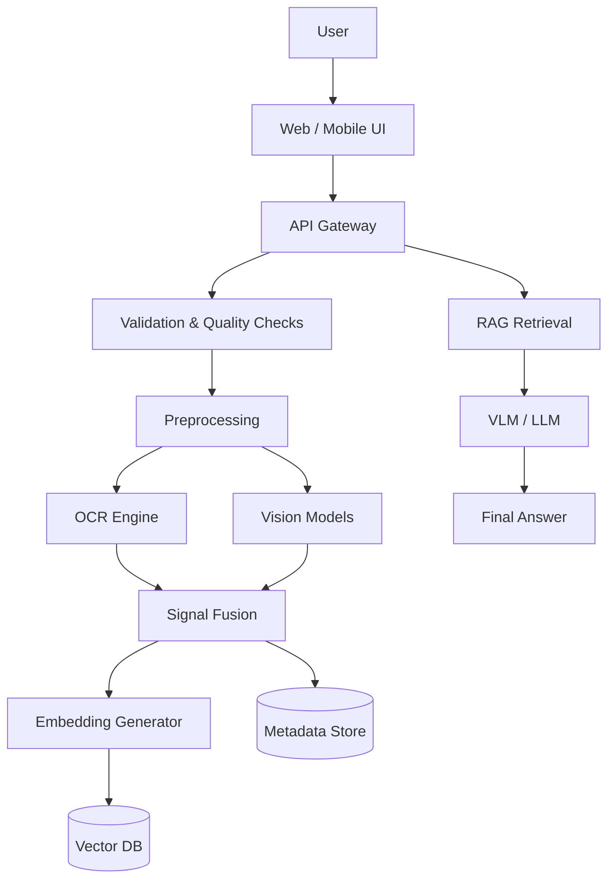
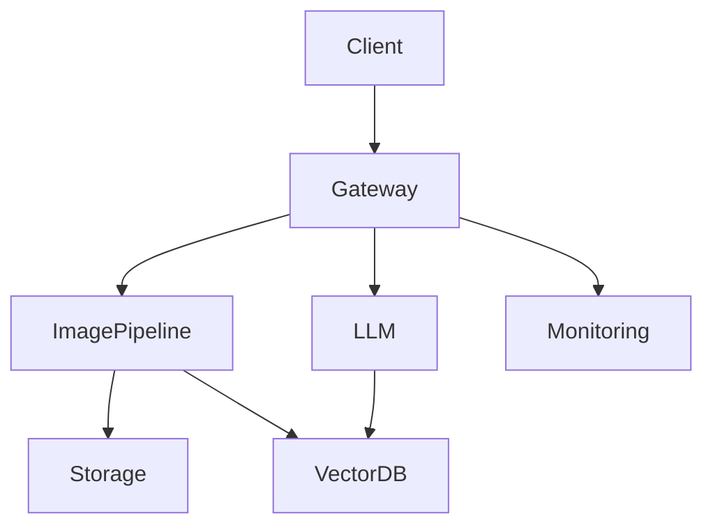
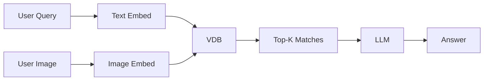
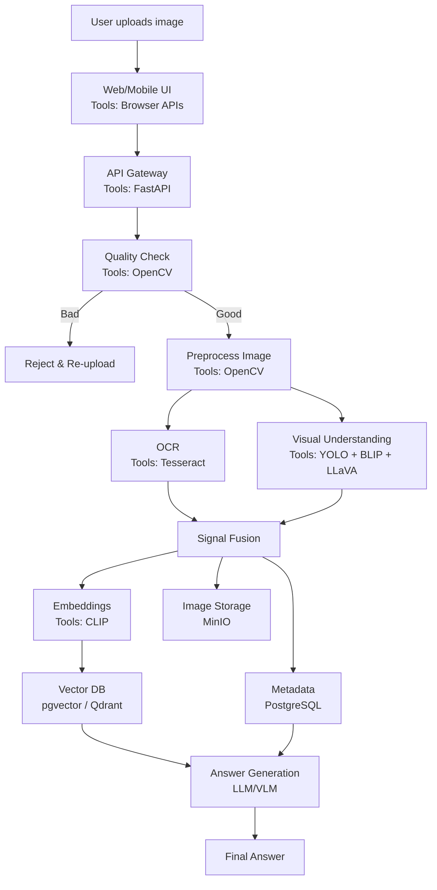

# Image Capturing & Processing for a Chatbot (HLD v1)

---

## Document Version Control

| Version | Date | Author | Change Description |
|--------|------|--------|-------------------|
| 1.0 | 2026-01-28 | IT Team | Initial HLD for image capture & processing chatbot |

---

## Table of Contents

1. Introduction  
2. Business Goals & Use Cases  
3. System Overview (End-to-End Flow)  
4. HLD Architecture  
5. Detailed Processing Pipeline  
6. Storage & Vectorization Design  
7. Free Tools & Stack  
8. Tool Comparison Matrix  
9. Security, Compliance & Retention  
10. Observability & KPIs  
11. Risks & Mitigations  
12. Recommended Architecture Blueprints

---

## 1. Introduction

### What this chatbot feature does

- User sends an image (photo / screenshot / document scan)
- System extracts meaning using **Computer Vision + AI**
  - OCR
  - Object detection
  - Image captioning
  - Image & text embeddings
- Chatbot answers with:
  - **Direct extraction** – *"What is written here?"*
  - **Understanding** – *"What’s happening in this image?"*
  - **Search** – *"Do we have similar images in our knowledge base?"*
  - **Action** – *Create ticket, fill form, classify, route, etc.*

---

## 2. Business Goals & Use Cases

### 2.1 Key Goals

- **Accuracy-first**
  - Reduce hallucinations by grounding responses in OCR text, detected objects, captions, and KB retrieval
- **Latency control**
  - Fast preview → deeper analysis only when required
- **Cost control**
  - Prefer open-source / free tools
  - GPU optional and on-demand

### 2.2 Primary Use Cases

#### A) User uploads an image → bot responds

- ID cards / invoices / forms → OCR + field extraction
- Error screenshots → OCR + troubleshooting lookup
- Asset/device photos → Object detection + issue classification

#### B) Existing image repository → semantic search

- Manuals, internal screenshots, product catalogs
- Vectorize images and metadata for similarity search

---

## 3. System Overview

### 3.1 End-to-End Flow (High Level)

**Key principle:** The chatbot never guesses directly from pixels. It answers only after structured signal extraction.

---

## 4. HLD Architecture

### 4.1 Logical Architecture (Layers)

| Layer | Responsibilities | Free Tooling |
|------|------------------|--------------|
| Client (Web/Mobile) | Capture, preview, compression, consent | Browser APIs, HTML5 |
| API Gateway | Auth, routing, rate-limit | FastAPI, Nginx |
| Image Pipeline Service | Preprocess, OCR, detection, captioning | OpenCV, Tesseract |
| Retrieval Layer | Vector search & filters | pgvector / Qdrant / Milvus |
| LLM/VLM Reasoning | Evidence-grounded response | LLaVA |
| Storage | Raw images & artifacts | MinIO, Postgres |
| Observability | Logs, metrics, traces | Prometheus, Grafana |

### 4.2 Deployment Topology

---

## 5. Detailed Processing Pipeline

### 5.1 Upload Quality Gate

**Fast validation checks:**

- File type allowlist (jpg, png, webp, pdf)
- Size limit & auto-resize
- Blur detection (Laplacian variance)
- Brightness / darkness check
- EXIF orientation fix
- Duplicate detection (hash)

**Why:** Prevents garbage-in → garbage-out and reduces compute cost.

---

### 5.2 Image Preprocessing (OpenCV)

- Resize to model-friendly resolution
- Noise reduction
- Contrast enhancement (OCR-friendly)
- Perspective correction (documents)
- Optional super-resolution (on demand)

---

### 5.3 OCR (Text Extraction)

**Tool:** Tesseract OCR

**Outputs:**

- Extracted text
- Word/line bounding boxes
- Confidence scores

---

### 5.4 Visual Understanding (Non-text)

#### Object Detection
- **YOLOv8** – fast, accurate (AGPL license)

#### Segmentation
- **Segment Anything (SAM / SAM2)** – pixel-level object masks

#### Image Captioning
- **BLIP** – converts image → descriptive text

#### Vision Chat / Reasoning
- **LLaVA** – image + text reasoning

---

### 5.5 Signal Fusion

A single structured payload is created:

| Field | Source | Example |
|------|-------|---------|
| ocr_text | Tesseract | "Windows error 0x..." |
| caption | BLIP / LLaVA | "Laptop screen showing error" |
| objects | YOLO | laptop, keyboard |
| regions | SAM | polygon masks |
| quality | OpenCV | blur=low |

All chatbot answers are grounded in this payload.

---

## 6. Storage & Vectorization Design

### 6.1 What to Store

- Raw image → Object storage (MinIO / S3)
- Derived artifacts:
  - OCR text
  - Captions
  - Detected objects
  - Embeddings

---

### 6.2 Vectorization Options

#### Option 1: Image Embeddings

- Use **CLIP / OpenCLIP**
- Best for image similarity search

#### Option 2: Text-First Embeddings

- OCR + caption → Sentence-Transformers
- Best for document-heavy images

**Recommended:** Store both image and text embeddings.

---

### 6.3 Retrieval Flow (Multimodal RAG)

---

## 7. Free Tools & Stack

| Layer | Tool | Notes |
|-----|-----|------|
| Preprocessing | OpenCV | Mature & fast |
| OCR | Tesseract | Best for printed text |
| Captioning | BLIP | Auto tagging |
| Vision Chat | LLaVA | VLM reasoning |
| Embeddings | CLIP / OpenCLIP | Multimodal |
| Vector DB | pgvector / Qdrant / Milvus | Scale-based |
| Backend | FastAPI | Simple & reliable |
| Async Jobs | Celery / RQ | Heavy pipelines |

---

## 8. Tool Comparison Matrix

### OCR Tools

| Tool | Strengths | Weaknesses | Best Fit |
|----|-----------|------------|----------|
| Tesseract | Offline, multilingual | Poor handwriting | Docs, screenshots |

### Detection & Segmentation

| Tool | Strengths | Weaknesses | Best Fit |
|----|-----------|------------|----------|
| YOLOv8 | Fast & accurate | AGPL license | Real-time detection |
| SAM | Best segmentation | Heavy compute | Object isolation |

### Vector Databases

| Tool | Strengths | Weaknesses | Best Fit |
|----|-----------|------------|----------|
| pgvector | Simple ops | Not massive scale | Small/medium apps |
| Qdrant | Strong filters | Extra service | Search-heavy apps |
| Milvus | Highly scalable | Infra complexity | Large systems |

---

## 9. Security, Compliance & Retention

### Security Controls

- Virus scan on upload
- MIME + magic-byte validation
- Signed URLs for storage
- PII masking in logs
- RBAC-based access

### Retention Policy

| Data | Retention | Reason |
|----|----------|-------|
| Raw Images | 30–180 days | Privacy & cost |
| OCR Text | Same as image | PII |
| Embeddings | Same or shorter | Sensitive |

---

## 10. Observability & KPIs

**Metrics:**

- Upload success rate
- OCR confidence average
- Retrieval hit-rate
- p95 latency
- GPU utilization
- Cost per request

---

## 11. Risks & Mitigations

| Risk | Impact | Mitigation |
|----|-------|-----------|
| Low-quality images | Wrong answers | Quality gate UX |
| Hallucination | Trust loss | Evidence-based responses |
| License issues | Legal risk | Early OSS review |
| Data leakage | High | Encryption & strict logs |

---

## 12. Recommended Architecture Blueprints

### Option A – Enterprise-ready (Free)

- OpenCV + Tesseract
- BLIP + LLaVA
- OpenCLIP embeddings
- Qdrant Vector DB
- MinIO + Postgres

### Option B – Simplest Ops

- OCR + captions → text embeddings
- pgvector inside Postgres

### Option C – Massive Scale

- Milvus Vector DB
- Distributed async workers
- Aggressive caching

---

# Image Understanding Chatbot — Architecture Flow (Layman Version)

## 🧠 Architecture Flow — Explained Like a Human Story

Think of this system as a **very disciplined office assistant** who follows fixed steps every time someone gives them a photo.

---

## 🧍 Step 1: User uploads an image
**(Phone / Laptop / Browser)**

**What happens**
- A person uploads a photo, screenshot, or scanned document.

**Why this step exists**
- This is the entry point. Nothing fancy yet.

**Tools used**
- Browser upload (HTML, mobile camera)

---

## 🚪 Step 2: Frontend sends image to the backend (Server)

**What happens**
- The image is sent to the server safely.
- The user sees a preview immediately.

**Why**
- Fast feedback so the user knows the upload worked.

**Tools**
- Browser APIs  
- FastAPI

---

## 🛂 Step 3: Image Quality & Safety Check (Gatekeeper)

Before doing any smart work, the system asks:
> “Is this image even worth processing?”

**Checks**
- Is the file real?
- Is it blurry or dark?
- Is it a supported format?
- Is it a duplicate?

**Tools**
- OpenCV

**Why this step is critical**
- Bad image = bad answer  
- Saves time and money

---

## 🧹 Step 4: Image Cleaning (Like wiping glasses)

**What we do**
- Resize
- Remove noise
- Fix rotation
- Improve contrast

**Tools**
- OpenCV

---

## 📝 Step 5: Read the text inside the image (OCR)

**Examples**
- Bills
- Error messages
- Forms
- IDs

**Tool**
- Tesseract OCR

**Why**
- Accurate, offline, free

---

## 👀 Step 6: Understand what the image shows (Non-text)

Even if there is no text, images still have meaning.

**Examples**
- Laptop screen
- Phone
- Document
- Error screenshot

**Tools**
- YOLO (object detection)
- BLIP (image description)
- LLaVA (image + question reasoning)

---

## 🧩 Step 7: Combine everything into ONE understanding

**Merged data**
- Text from OCR
- Objects detected
- Image description
- Image quality

**Why**
- AI answers only from facts
- No guessing or hallucination

---

## 🗄️ Step 8: Save useful information

**What gets stored**
- Image
- Extracted text
- Image meaning
- Vector fingerprints

**Tools**
- MinIO / S3 (image storage)
- PostgreSQL (metadata)
- pgvector / Qdrant (similarity search)

---

## 🔍 Step 9: Search old knowledge (If needed)

If user asks:
> “Have we seen this before?”

**Tools**
- Vector DB (pgvector / Qdrant)

---

## 🗣️ Step 10: Final Answer to User

**How AI answers**
- Based on extracted facts
- Based on stored knowledge
- Never guesses

**Tool**
- LLM / VLM

---

## 🧰 Tool Summary

| Tool | What it does | Why chosen |
|----|----|----|
| OpenCV | Image cleaning & checks | Fast, free |
| Tesseract | OCR | Reliable, offline |
| YOLO | Object detection | Accurate |
| BLIP | Image caption | Simple |
| LLaVA | Image reasoning | Open-source |
| FastAPI | Backend | Stable |
| PostgreSQL | Data storage | Rock-solid |
| pgvector / Qdrant | Similarity search | Best fit |
| MinIO | Image storage | Cheap & safe |

---

## 🧩 One-Page Architecture Diagram (Mermaid)

---

## 🎯 One-line summary

This architecture works like a careful human assistant who **checks, cleans, reads, understands, remembers, and then answers using only facts**.

**End of Document**

